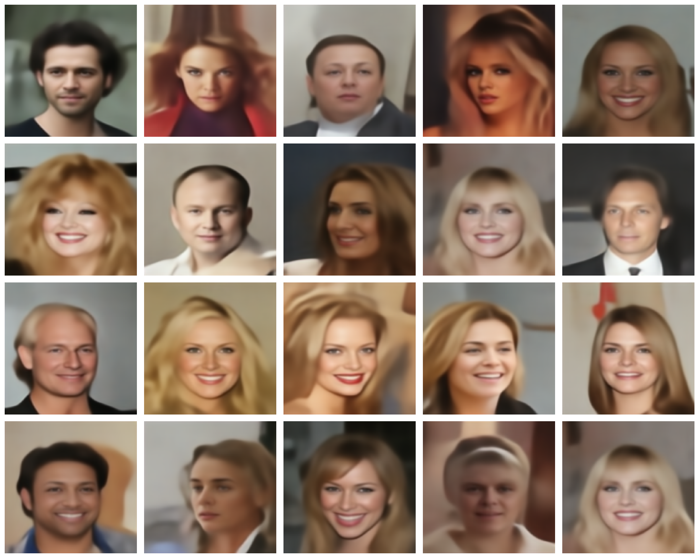

# Latent Schrödinger Bridge
### Optimal Transport for Image Generation via VAE

<p align="center">
  
  <br>
  <em>Figure 1: Overview of the proposed pipeline. Offline phase (left): latent representations of CelebA images are extracted via the VAE encoder and the discrete Sinkhorn optimal transport potential g* is computed. Online phase (right): a noise sample is transported to the target distribution via gradient flow guided by g*, then decoded into a face image.</em>
</p>

---

## Overview

This repository contains the official implementation of **"Latent Schrödinger Bridge: Optimal Transport for Image Generation via VAE"**.

We propose a generative framework that combines **Variational Autoencoders (VAE)** with **Schrödinger Bridge optimal transport** to generate high-quality face images. Rather than operating in pixel space, we perform optimal transport entirely in the **latent space** of a VAE (following the architecture of Rombach et al., 2022) — making the transport problem tractable and the generation fast.

The key idea is to learn a discrete Sinkhorn potential `g*` that maps a Gaussian noise distribution to the latent distribution of real images (CelebA), then use a **gradient flow** to transport noise samples to realistic latent codes, which are finally decoded into images.

> **Keywords**: VAE, Schrödinger Bridge, Sinkhorn, optimal transport, latent diffusion, generative model, image generation, CelebA.

---

## Method

### Two-phase pipeline

The method is divided into an **offline pre-processing phase** and a **fast online inference phase**.

#### Offline — Computing the Sinkhorn potential

1. **Encode target distribution**: pass CelebA images through the VAE encoder to obtain a set of latent vectors `{y_i} ⊂ ℝ^1024`, which represent the target distribution `μ`.
2. **Define source distribution**: draw noise samples `z ~ N(0, I)` as the source distribution `ν`.
3. **Solve the Schrödinger Bridge**: run discrete Sinkhorn iterations between `ν` and `μ` to compute the entropic optimal transport potential `g*`, defined as:

```
g* = argmin W_ε(ν, μ)
```

where `W_ε` is the entropic Wasserstein distance with regularization `ε`. This step is done **once** and `g*` is stored on disk.

#### Online — Gradient flow inference

Given a stored potential `g*`, generating a new image requires:

1. Sample `z_0 ~ N(0, I)`.
2. Run `N_steps` iterations of gradient flow in latent space:

```
z_{t+1} = z_t - τ · ∇_z F_ε(z_t)
```

where `F_ε` is the free energy functional guided by `g*` and `τ` is the step size.

3. Decode the transported latent `z*` through the VAE decoder to obtain the generated image `x̂`.

---

## Generated samples

<p align="center">
  <!-- Replace with your generated samples grid -->
  
  <br>
  <em>Figure 2: Samples generated by the proposed method on CelebA 128×128.</em>
</p>

---


## Repository structure

```
vae-schrodinger-bridge/
│
├── Models/
│   ├── Encoder.py              # VAE encoder architecture
│   └── Decoder.py              # VAE decoder architecture
│
├── Utils/
│   ├── utils_sinkhorn.py       # Core: Sinkhorn iterations, gradient flow, generation
│   └── data.py                 # CelebA dataset and transforms
│
├── Options/
│   └── sinkhorn.yml            # All hyperparameters and paths
│
├── Latents/                    # Stored latent vectors {y_i} (generated offline)
├── Potentials/                 # Stored Sinkhorn potentials g* (generated offline)
├── Images/                     # Output generated images
│
├── main.py                     # Main entry point
└── README.md
```

---

## Installation

```bash
git clone https://github.com/alekseim02/vae-schrodinger-bridge.git
cd vae-schrodinger-bridge
pip install -r requirements.txt
```

**Requirements**: Python 3.8+, PyTorch 2.0+, torchvision, Pillow, PyYAML.

---

## Usage

All parameters are controlled via `Options/sinkhorn.yml`. The pipeline has three sequential steps:

### Step 1 — Extract latent codes (offline)

Encode CelebA images into latent space and store them:

```bash
python main.py --mode calculate_pt
```

This produces `Latents/latents_{n_samples}_celeba.pt`.

### Step 2 — Compute the Sinkhorn potential (offline)

Solve the discrete Schrödinger Bridge between noise and the latent CelebA distribution:

```bash
python main.py --mode calculate_potentials
```

This produces `Potentials/g_{n_source}_{n_target}_{eps}_discrete.pt`.

### Step 3 — Generate images (online)

Transport noise samples through the learned potential and decode:

```bash
python main.py --mode generate --pot_path Potentials/g_XXXX_XXXX_X.X_discrete.pt
```

Generated images are saved in `Images/`.

### Manual parameter override

Any parameter can be overridden interactively at runtime:

```bash
python main.py --mode generate --manual
```

---

## Configuration

Key parameters in `Options/sinkhorn.yml`:

| Parameter | Description |
|---|---|
| `eps` | Entropic regularization for Sinkhorn (`W_ε`) |
| `n_target_pt` | Number of CelebA latents to encode |
| `n_source_potentials` | Source samples for potential computation |
| `n_target_potentials` | Target samples for potential computation |
| `iters_max` | Maximum Sinkhorn iterations |
| `tau` | Step size for gradient flow |
| `Nsteps` | Number of gradient flow steps |
| `n_generated` | Number of images to generate |

---

## Acknowledgements

This work builds upon the Schrödinger Bridge estimation framework proposed in:

> Pooladian, A. et al. **"Plug-in estimation of Schrödinger bridges"** (2024).
> Code available at [github.com/AramPooladian](https://github.com/AramPooladian) — used under MIT License.
> Copyright (c) 2024 AramPooladian.

This work also uses a VAE architecture inspired by:

> Rombach, R. et al. "High-Resolution Image Synthesis with Latent Diffusion Models", CVPR 2022.
---

## Citation

If you find this work useful, please cite:

```bibtex
@article{latent_schrodinger_bridge_2025,
  title   = {Latent Schrödinger Bridge: Optimal Transport for Image Generation via VAE},
  author  = {Alejandro Martínez Álvarez, Bruno Longarela Fuente},
  year    = {2025},
  url     = {https://github.com/aleksim02/vae-schrodinger-bridge}
}
```

---

## License

This project is licensed under the MIT License — see [LICENSE](LICENSE) for details.